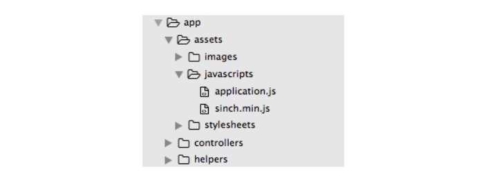
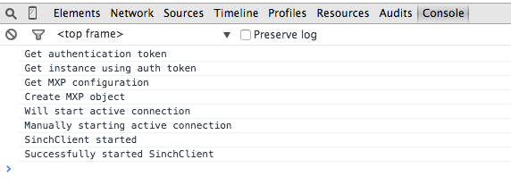

#Authenticating to Sinch from your Rails App with Devise

This tutorial will walk you through authenticating users to the [Sinch JavaScript SDK](https://www.sinch.com/web-sdk/) with a Rails backend. You will use the devise gem to securely authenticate and store your users' info. Once users are authenticated with devise, you will generate a token and pass it to the Sinch JavaScript SDK. From there, you can follow our [calling or messaging tutorials](https://www.sinch.com/tutorials/) to build out the functionality of your app.

##Sinch Setup
1. Sign up for a Sinch account at [www.sinch.com/signup](https://www.sinch.com/signup)
2. In the developer dashboard, create a new app and take note of the app key and secret
3. Download the Sinch JavaScript SDK at [www.sinch.com/downloads](https://www.sinch.com/downloads)

##Project Setup
First, create a new rails app, and move into the project directory:

    $ rails new NameOfYourApp
    $ cd NameOfYourApp
    
And create the main controller. I'll call mine `SinchController`:

    $ rails generate controller sinch --no-test-framework
    
To add the Sinch SDK to your project, add **sinch.min.js** to your JavaScript folder:

    
To set up devise, add the following to your Gemfile:

    gem 'devise'
    
Then bundle install and set up devise:

    $ bundle install
    $ rails generate devise:install
    $ rails generate devise User
    $ rake db:migrate
    
##Authenticate!
You will want to generate the token for Sinch after a user has logged in or registered with devise. You can do this by overriding `after_sign_in_path_for(user)` and `after_sign_up_path_for(user)`. Add the following in **ApplicationController.rb** and be sure to fill in your app key and secret from the Sinch dashboard:

    def after_sign_in_path_for(user)
      after(user.email)
    end

    def after_sign_up_path_for(user)
      after(user.email)
    end

    #keep your code DRY!
    def after(email)
      #temporarily store ticket in session
      session[:ticket] = get_auth_ticket(email)
      root_path
    end

    #generate ticket for Sinch authentication
    def get_auth_ticket(username)
      user_ticket = {
        "identity" => {"type" => "username", "endpoint" => username},
        "expiresIn" => 3600, #seconds
        "applicationKey" => "your_app_key",
        "created" => Time.now.utc.iso8601
      }

      user_ticket_json = user_ticket.to_json.gsub(/\s+/, "")
		user_ticket_base64 = Base64.encode64(user_ticket_json).strip
		digest = OpenSSL::HMAC.digest(OpenSSL::Digest.new('sha256'), Base64.decode64("your_app_secret"), user_ticket_json).strip
		signature = Base64.encode64(digest).strip
		return (user_ticket_base64 + ':' + signature).gsub(/\s+/, "")
    end
    
Then, in **SinchController.rb**, add the following to make the ticket accessible in the view:

    class SinchController < ApplicationController
      before_action :authenticate_user!

      def index
        @ticket = session[:ticket]
		  session[:ticket] = nil

		  redirect_to new_user_session_path if @ticket == nil
      end
    end
    
In the above code, you look for the ticket in the session storage. If there is no ticket, re-authenticate the user with devise. If there is a current valid devise session, users won't see a login page, but rather, `after_sign_up_path_for(user)` will automatically get called, generating a new Sinch ticket. If there is a ticket, you will get access the @ticket variable in your view. `session[:ticket]` will be set to nil so that it can be reset next time a user logs in.

##Authenticate Using the sinch_auth Gem

Alternatively, you can use the `sinch_auth` gem to take care of creating the token. First, add the `gem 'sinch_auth'` to your Gemfile and bundle install.

The gem generates the ticket that you have created by hand in `get_auth_ticket`. You can use it like so:

    sinchAuth = SinchAuth.new
    ticket = sinchAuth.get_auth_ticket(username, expires_in, key, secret)
    
In the above example, pass in a string username, the number of seconds you want the token to expire in, your app key, and your app secret.

##The View
Next, you will make 'sinch#index' the root path, and start the Sinch client in that view.

Add to routes.rb:

      root 'sinch#index'
      
Add sample html body and start the Sinch client in **sinch/index.html.erb**. Don't forget to replace "your_app_key" with your app key from above:

    

      <%= link_to "Sign Out", destroy_user_session_path, :method => :delete, :id => "signOut" %>
    

		
	 

      Sinch client started!
    

    
    
    
A few notes about the code above:
1. Upon sign out, terminate the Sinch client.
2. Use the auth ticket you generated, `@ticket`, to start the Sinch client.
3. Reveal the UI when the Sinch client is started. This will take 1-2 seconds.

To test out your app, start a local rails server, and navigate to [http://0.0.0.0:3000](http://0.0.0.0:3000):

    $ rails server
    $ open https://0.0.0.0:3000
    
Open the developer console in your browser to see real-time updates of the Sinch client:

Congrats, you did it! You can now use the Sinch client to add calling or messaging to your web app. Check out the following tutorials to continue with your app:

- Web-web calling [sinch.com/tutorials/turn-browser-phone-js-sdk](https://www.sinch.com/tutorials/turn-browser-phone-js-sdk/)    
- Web-phone calling [sinch.com/tutorials/using-sinch-js-sdk-make-voice-calls](https://www.sinch.com/tutorials/using-sinch-js-sdk-make-voice-calls/)    
- Instant messaging [sinch.com/tutorials/build-instant-messaging-app-sinch-javascript](https://www.sinch.com/tutorials/build-instant-messaging-app-sinch-javascript/)
